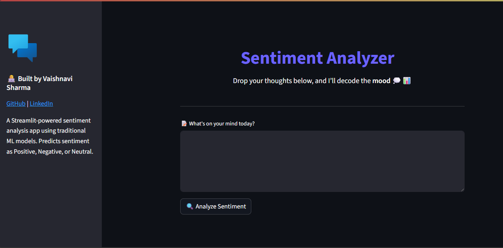

# Sentiment Analyzer 

A machine learning-based sentiment analysis system designed to classify text into **positive**, **neutral**, or **negative** categories. This project implements classical NLP preprocessing, model training, and evaluation, and is capable of batch prediction and real-time sentiment inference.

---

## 📌 Project Overview

This sentiment analysis pipeline is built to:

- Process raw text
- Clean and normalize it using **NLTK**
- Extract features using **TF-IDF** and **CountVectorizer**
- Classify sentiments using classical **supervised learning** models

The final deployed model—**Random Forest with TF-IDF**—achieved a validation accuracy of **70.37%**, demonstrating reliable performance on multi-class sentiment prediction.

---
## 🧾 Dataset

- **Training samples:** 27,481 rows
- **Test samples:** 4,815 rows  
- **Columns include:**
  - `textID`, `text`, `sentiment` (target)
  - Additional metadata: timestamp, country, age, population density, etc.

> Note: The dataset includes some missing values and a large `.csv` file which has been excluded from version control for compliance with GitHub file size limits.

---

## 🛠 Features

- Text cleaning: Lowercasing, removing URLs, mentions, HTML tags, punctuation, numbers
- NLP preprocessing: Tokenization, stopword removal, lemmatization
- Model training with:
  - Logistic Regression
  - Naive Bayes
  - Linear SVC
  - Random Forest (final best model)
- Vectorization:
  - `CountVectorizer`
  - `TfidfVectorizer`
- Model evaluation:
  - Classification reports (precision, recall, f1-score)
  - Confusion matrices
  - Misclassified example analysis
- Final model persistence using `pickle`
- Real-time prediction with a clean API-style function
- Batch prediction support

---

## 🏆 Model Performance

| Model                          | Accuracy |
|-------------------------------|----------|
| Logistic Regression + TF-IDF  | 69.24%   |
| Naive Bayes + CountVectorizer | 65.54%   |
| Linear SVC + TF-IDF           | 67.62%   |
| **Random Forest + TF-IDF**    | **70.37%** ✅ |

---

## 📈 Evaluation Snapshot

🔍 Streamlit App Preview

Here’s a quick look at the user interface of the deployed app:

🌱 Future Scope
📦 Integrate Git LFS for handling large datasets

🌐 Deploy backend with FastAPI or Flask for scalable APIs

🎯 Enhance preprocessing with custom text augmentation

🤖 Integrate BERT or transformers for improved semantic understanding

📊 Add interactive visualizations using Plotly or Altair in Streamlit

🧪 Extend support to multilingual sentiment analysis

