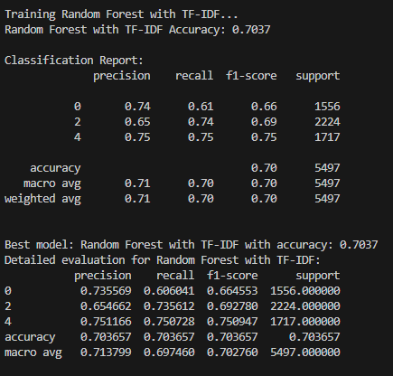

# Sentiment Analyzer 

## 📚 Table of Contents

- [🚀 Try it out now](#-try-it-out-now)
- [📌 Project Overview](#-project-overview)
- [🧾 Dataset](#-dataset)
- [🛠 Features](#-features)
- [🚀 Getting Started](#-getting-started)
- [📦 Tech Stack](#-tech-stack)
- [🏆 Model Performance](#-model-performance)
- [📈 Evaluation Snapshot](#-evaluation-snapshot)
- [🌱 Future Enhancements](#-future-enhancements)
- [📬 Contact](#-contact)
---
A machine learning-based sentiment analysis system designed to classify text into **positive**, **neutral**, or **negative** categories. This project implements classical NLP preprocessing, model training, and evaluation, and is capable of batch prediction and real-time sentiment inference.

## 🚀 Try it out now  
👉 [Click here to open the app](https://sentiment-analyzer-nu3ynugamjk5yt5gadukcy.streamlit.app/)
---

## 📌 Project Overview

This sentiment analysis pipeline is built to:

- Process raw text
- Clean and normalize it using **NLTK**
- Extract features using **TF-IDF** and **CountVectorizer**
- Classify sentiments using classical **supervised learning** models

The final deployed model—**Random Forest with TF-IDF**—achieved a validation accuracy of **70.37%**, demonstrating reliable performance on multi-class sentiment prediction.

---
## 🧾 Dataset

- **Training samples:** 27,481 rows
- **Test samples:** 4,815 rows  
- **Columns include:**
  - `textID`, `text`, `sentiment` (target)
  - Additional metadata: timestamp, country, age, population density, etc.

> Note: The dataset includes some missing values and a large `.csv` file which has been excluded from version control for compliance with GitHub file size limits.

---

## 🛠 Features

- Text cleaning: Lowercasing, removing URLs, mentions, HTML tags, punctuation, numbers
- NLP preprocessing: Tokenization, stopword removal, lemmatization
- Model training with:
  - Logistic Regression
  - Naive Bayes
  - Linear SVC
  - Random Forest (final best model)
- Vectorization:
  - `CountVectorizer`
  - `TfidfVectorizer`
- Model evaluation:
  - Classification reports (precision, recall, f1-score)
  - Confusion matrices
  - Misclassified example analysis
- Final model persistence using `pickle`
- Real-time prediction with a clean API-style function
- Batch prediction support

---

## 🚀 Getting Started 

1. **Clone the repository**

git clone https://github.com/Vaishnavish05/Sentiment-Analyzer.git 

cd Sentiment-Analyzer

2. **Install dependencies** 

pip install -r requirements.txt

3. **Run sentiment analysis**

python src/sentiment_analysis.py 

4. **Launch the Streamlit app** 

streamlit run app/app.py

## 📦 Tech Stack
- Python
- Streamlit
- scikit-learn
- NLTK
- Google Drive + `gdown` (for model hosting)

---

## 🏆 Model Performance

| Model                          | Accuracy |
|-------------------------------|----------|
| Logistic Regression + TF-IDF  | 69.24%   |
| Naive Bayes + CountVectorizer | 65.54%   |
| Linear SVC + TF-IDF           | 67.62%   |
| **Random Forest + TF-IDF**    | **70.37%** ✅ |

---

## 📈 Evaluation Snapshot

🔍 Streamlit App Preview

Here’s a quick look at the user interface of the deployed app:

---

## 🌱 Future Enhancements

- **Git LFS Integration**  
  Enable seamless handling of large files such as datasets and trained models, ensuring efficient version control and repository management.

- **RESTful API Deployment (FastAPI / Flask)**  
  Expand accessibility by serving the model through a scalable backend API, supporting integration with third-party applications or client-side interfaces.

- **Advanced NLP Techniques**  
  Explore transformer-based architectures (e.g., BERT, RoBERTa) to enhance model accuracy and capture deeper contextual sentiment.

- **Text Augmentation Strategies**  
  Improve model generalization by introducing data augmentation methods such as synonym replacement, back translation, and random insertion.

- **Multilingual Sentiment Analysis**  
  Extend support to additional languages to make the solution more inclusive and applicable to a global user base.

## 📬 Contact
Developed by [Vaishnavi Sharma](mailto:navi.vsh05@gmail.com)
🔗 [LinkedIn](https://www.linkedin.com/in/vaishnavi-sharma05) 

> ⚙️ This project was built by adapting and extending publicly available resources for educational purposes. Credits to the open-source community for foundational ideas and datasets.
